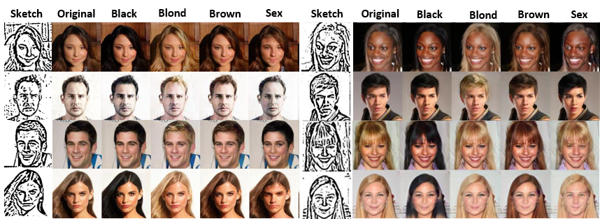

## [Quality Guided Sketch-to-Photo Image Synthesis](https://arxiv.org/abs/2005.02133):
### PyTorch Implementation
<p align="center"></p>


> [Uche Osahor](https://github.com/Electronicshelf)<sup>1</sup>, 
[Hadi Kazemi]<sup>1</sup>, 
[Ali Dabouei]<sup>1</sup>,[Nasser Nasrabadi]<sup>1</sup>, <sup>1</sup> [West Virginia University] <br/>
<br/>
https://arxiv.org/pdf/2005.02133.pdf <br>
**Abstract:** 
Facial sketches drawn by artists are widely used for vi-sual identification applications and mostly by law enforce-ment agencies, but the quality of these sketches depend onthe ability of the artist to clearly replicate all the key fa-cial  features  that  could  aid  in  capturing  the  true  identityof  a  subject.   Recent  works  have  attempted  to  synthesizethese sketches into plausible visual images to improve vi-sual recognition and identification.  However, synthesizingphoto-realistic images from sketches proves to be an evenmore challenging task, especially for sensitive applicationssuch as suspect identification.  In this work, we propose anovel  approach  that  adopts  a  generative  adversarial  net-work that synthesizes a single sketch into multiple syntheticimages with unique attributes like hair color, sex, etc. We in-corporate a hybrid discriminator which performs attributeclassification of multiple target attributes, a quality guidedencoder that minimizes the perceptual dissimilarity of thelatent space embedding of the synthesized and real imageat different layers in the network and an identity preserv-ing network that maintains the identity of the synthesisedimage  throughout  the  training  process.   Our  approach  isaimed at improving the visual appeal of the synthesised im-ages while incorporating multiple attribute assignment tothe generator without compromising the identity of the syn-thesised image. We synthesised sketches using XDOG filterfor the CelebA, WVU Multi-modal and CelebA-HQ datasetsand from an auxiliary generator trained on sketches fromCUHK, IIT-D and FERET datasets. Our results are impres-sive compared to current state of the art.

## Installation
```bash
pip install <package>
```
### Virtual enviroment was created with ANACONDA.

	Torchvision 0.3.0
	Pillow 6.1.0
	python 3.6.9
	numpy 1.18.4
	tk 8.6.8
	PyTorch 1.1.0
	matplotlib 3.1.1
	scikit-image 0.15.0
	tqdm 4.46.0
	visdom 0.1.8.8
	tensorboard 1.14.0
	cudnn 7.6.0

# HINTS
- To use a new sketche style, the sketches must be trained with the model from scratch. Its best to use pictures with a white background or a single background color. This would reduce computational time and place more attention on the facial feataures.

- The pictures should be cropped to contain just the head of the subject.

- Attributes must be assigned to each subject and arrranged in the format similar to data/CelebAMask-HQ-att.txt (same with CELEBA attribute assignment format).

- The program is set to Launch in GUI mode. However, the instructions below are meant to guide the user on how to change the necessary parametrs for customising. 

- main.py

    ### Model configuration.
    > Image default size is set to 256, reperesenting 256x256 pixels
    --image_size, type=int, default=256, help='image resolution'

    ### Training configuration.
     >For Training and Testing, set dataset default='CelebA' to view in GUI set default='GUI'. presently, its in GUI mode.
    --dataset, type=str, default='CelebA', choices=['CelebA', 'RaFD', 'Both','GUI']
    --batch_size, type=int, default=4, help='mini-batch size'
    --num_iters, type=int, default=10000000, help='number of total iterations for training D'
    
    ### Test configuration.
    > default value represent filename number in data/models directory. currently, 1570000 is the highest value and the best file for testing
    --test_iters, type=int, default=1570000, help='test model from this step'
   
    # Miscellaneous.
    > Select Program mode. default value can be set to 'train', 'test' or 'test_gui' 
    --mode, type=str, default='test_gui', choices=['train', 'test', 'test_gui']
  
    ## Directories... /data/ 
    > Directories of current datasets are in default mode. the 'data' directory contains all the directories for all file need for the program
    > celeba_image_dir, type=str, default='/data/CelebA-HQ-White-Background
    > celeba_image_dir_skt, type=str, default='/data/CelebA-HQ-White-Background-Sketch
    > attr_path, type=str, default='/data/CelebAMask-HQ-att

  STORE SKETCHES FOR TESTING IN THIS FOLDER 
    > cgui_image_dir_skt, type=str, default='data/test_Sketch
  

   > default location for miscellaneous files 
    --log_dir, type=str, default='data/logs
    --model_save_dir, type=str, default='data/models
    --sample_dir, type=str, default='data/samples
    --result_dir, type=str, default='data/results
   
   > Step size defines when to save the sample files while training 
    # Step size.
    --sample_step, type=int, default=500
    
## data_loader_gui.py
	# Dataloader >> All values  are already set as default
    x = "data"
    A = "test_Sketch"

## data_loader.py
	# Dataloader >> All values  are already set as default
	x = "/data"
    A = "CelebA-HQ-White-Background"
    B = "CelebA-HQ-White-Background-Sketch"


## Citation
If you find this work useful for your research, please cite our [paper](https://arxiv.org/abs/2005.02133):
```

@article{Osahor2020QualityGS,
  title={Quality Guided Sketch-to-Photo Image Synthesis},
  author={Uche M. Osahor and Hadi Kazemi and Ali Dabouei and N. Nasrabadi},
  journal={2020 IEEE/CVF Conference on Computer Vision and Pattern Recognition Workshops (CVPRW)},
  year={2020},
  pages={3575-3584}
}
```

#### Also cite
```
@inproceedings{choi2018stargan,
author={Yunjey Choi and Minje Choi and Munyoung Kim and Jung-Woo Ha and Sunghun Kim and Jaegul Choo},
title={StarGAN: Unified Generative Adversarial Networks for Multi-Domain Image-to-Image Translation},
booktitle={Proceedings of the IEEE Conference on Computer Vision and Pattern Recognition},
year={2018}
}
```


## License
[MIT](https://choosealicense.com/licenses/mit/)
